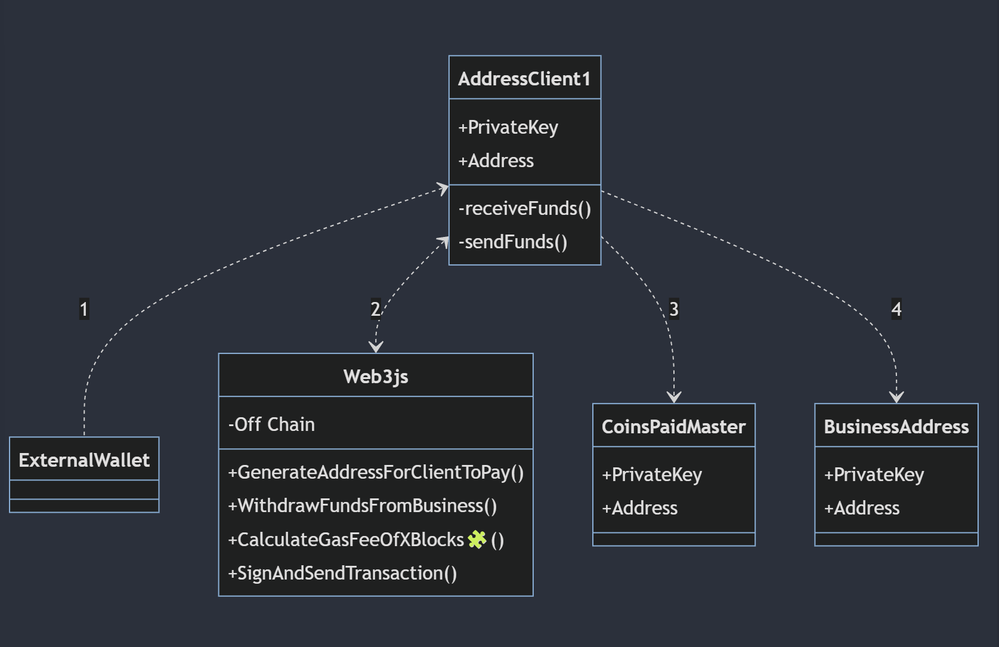

# CoinsPaid-Hackathon

## Current situation

- CoinsPaid has a pool of addresses that they give(or generate them) to their businesses when they request an address to receive a payment
- The businesses share these addresses to the clients
- The clients send the funds to these addresses generated by CoinsPaid (pool of addresses)
- For the hackathon, only manage ETH (no ERC20s) - by Yurii

### Flow

### Improvements:

- address generation off-chain
- payment aggregation: gathering all the funds from those addresses, and sending them to the business directly (send 99% of the funds to the business directly and not sending funds to the master contract/coinspaid wallet) and do offchain signing transactions.
- withdraw/gas optimization to send TXs when there are 'low fees'

## Future implementations

- implement automated transaction in the web3 plugin when the fees are low

- use AI large language model (LLMs) to predict gas prices based on past data

- create a classification model that determines whether it is a good time to perform a transaction or not

# Starting the nextjs App

git clone the repo

`cd ./App`

`yarn`

`yarn run dev`
