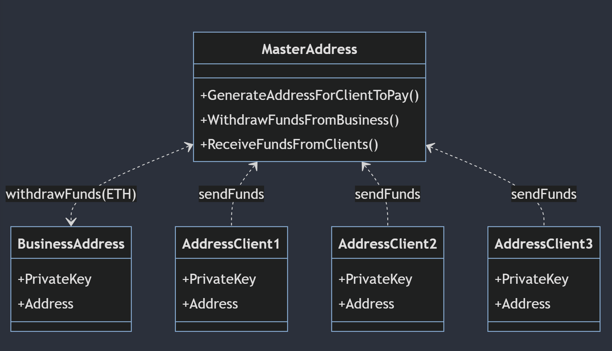

# CoinsPaid-Hackathon

## Current situation

- CoinsPaid has a pool of addresses that they give(or generate them) to their businesses when they request an address to receive a payment
- The businesses share these addresses to the clients
- The clients send the funds to these addresses generated by CoinsPaid (pool of addresses)
- For the hackathon, only manage ETH (no ERC20s)

### Flow

1. CoinsPaid generate an address for the clients to send the funds
2. Clients send funds to these generated addresses
3. CoinsPaid gather all the funds from these addresses
4. Business wants to withdraw, so CoinsPaid send the funds from the generated addresses to the businessAddress

### Improvements:

- address generation off-chain
- payment aggregation: gathering all the funds from those addresses, and sending them to the business directly (send 99% of the funds to the business directly and not sending funds to the master contract/coinspaid wallet) and do offchain signing transactions.
- withdraw/gas optimization to send TXs when there are 'low fees'

## Ideal situation

# Starting the nextjs App

git clone the repo

`cd ./App`

 `yarn`

`yarn run dev`
